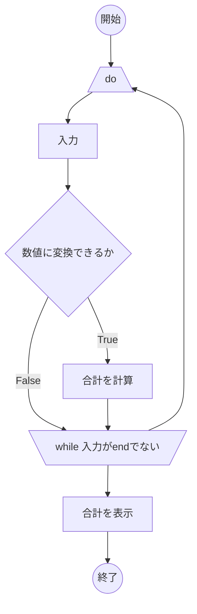

# 003 足し算
ユーザーに複数の数字を入力させて、すべての合計を表示する。ユーザーは数字をいくつでも入力できるようにして、"end"と入力したところですべての合計を表示すること。
## 具体例
### case1
- output:合計を求めます。好きなだけ数値を入力してください。
- input:10
- output:数値を入力してください。合計を表示するには"end"と入力してください。
- input:10
- output:数値を入力してください。合計を表示するには"end"と入力してください。
- input:end
- output:合計は20です

### case2
- output:合計を求めます。好きなだけ数値を入力してください。
- input:10
- output:数値を入力してください。合計を表示するには"end"と入力してください。
- input:-10
- output:数値を入力してください。合計を表示するには"end"と入力してください。
- input:end
- output:合計は0です

### case3
- output:合計を求めます。好きなだけ数値を入力してください。
- input:10.1
- output:数値を入力してください。合計を表示するには"end"と入力してください。
- input:10
- output:数値を入力してください。合計を表示するには"end"と入力してください。
- input:end
- output:合計は20.1です

### case4
- output:合計を~
- input: abc
- output: 数値以外です
  
### case5
- output:合計を~
- input: 10
- output: 数値を~
- input: abc
- output: 数値以外です

### case6
- output:合計を~
- input: end
- output: 数値以外です

## TODOリスト
### 準備作業
- vscodeを起動する
- ファイルを作る
  - パッケージを作る
  - Sum.javaファイルを作る
- クラスを作る
  - Sumクラスを書く
  - 空のmainメソッドを作る

### 入力
- 空のdouble型の変数sumを作る
- "end"と入力されるまで繰り返し数値を入力する
  - do whileループを作る
  - Scannerを作る
    - インポートする
      - java.util.Scanner
    - System.inを渡してnewする
      - new Scanner(System.in)
    - 変数scannerに格納する
      - Scanner scanner
  - Scanner.nextLine()で数値を入力する
  - String型の変数strに格納する
  - print()でstrを表示して動作確認
    - System.out.println(str)

### 処理
- 入力された値が数値かendかを確認する
  - 数値に変換できるか
    - try { Double.parseDouble(str)}
    - catch(NumberFormatException e) {  }
    - 数値に変換できれば合計を求める
    - 数値以外であればもう一度繰り返す(endでループ終了)
      - while(!str.equals("end"))
- 合計を求める
  -   sumにnumを加算する

### 出力
- 合計を表示する
  - System.out.println("合計は"+sum+"です")でsumの値を出力する
  
### 動作確認
- "10"、"10"を入力して確認
- "10"、"-10"を入力して確認
- "10.1"、"10"を入力して確認
- "10"、"abc"を入力して確認
- "abc"を入力して確認
- "end"を入力して確認

## フローチャート

